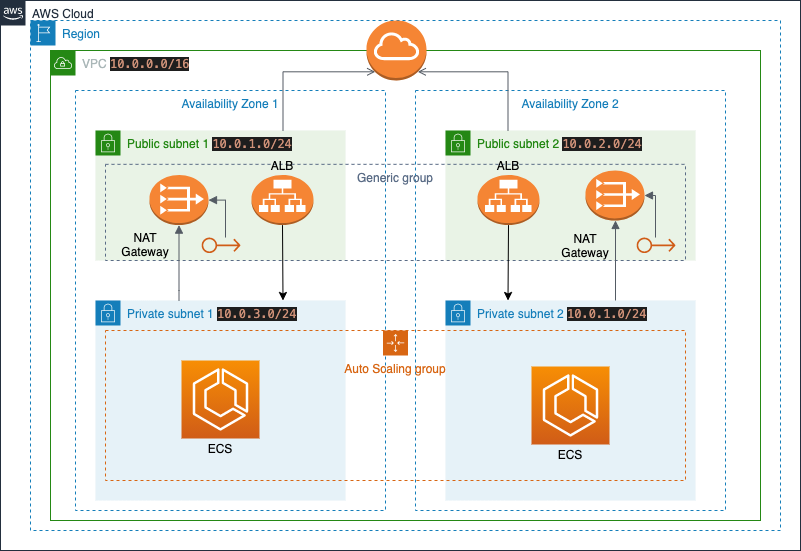

# ECS Cluster Using Terraform 

I assume you have some knowledge about ECS as you are already here looking at my Github and trying to figure out how you can provision ECS cluster using Terraform. 

Let's get started. The script has different modules for Networking, IAM, Load Balancer(ALB) and ECS. You can launch ECS cluster in any region in AWS. If you would like to override any variable, you can define it in [terraform.tfvars](#terraform.tfvars) file.    

---------
## `Architecture:`

    

---------
## `Commands:`

```bash
git clone https://github.com/jpolara2016/terraform_ecs.git
cd terraform_ecs
terraform init
terraform plan
terraform apply
```
  
---------  
## `Features:`

* Isolated in a VPC
    * High-availability (Multi-AZ deployment)
      * Public Subnet (Internet access via IG)
      * Private Subnet (Internet access via NAT Gateway)
    * Route Table for each subnet
    * NAT Gateway in each public subnet
* Security
    * Security Groups for ALB and EC2
    * Application instances in private subnets
* Load Balancer (ALB)
    * Target Group
    * Listener
    * Auto-scaling
* Dynamic Port Mapping
* ECS Cluster
    * Task Definition
    * Service
    * Tasks
* Fault-tolerant architecture
    * Application update in 0 min downtime when you update ECS service
* Cost-effective
    * Use Spot instance with Auto Scaling to save $$$
  
---------
## `terraform.tfvars:`
```json
# Specify environment
environment = "dev"

# Application details, such as name, container name, port and image url
application_name = "test-app"
container_name = "test-app"
container_port = 5000
image_url = "jpolara2016/test_app:latest"

# VPC CIDR range
vpc_cidr = "10.0.0.0/16"

# Public/Private CIDR range
public_subnets_cidr = ["10.0.1.0/24", "10.0.2.0/24"]
private_subnets_cidr = ["10.0.3.0/24", "10.0.4.0/24"]

# AWS region
region = "us-east-1"

# Make sure you specify AZ accordinly based on Subnets
availability_zones = ["us-east-1a", "us-east-1b"]

# Add your local ipv4 for SSH access
my_ipv4 = ["97.102.162.197/32"]

# Destination IP for outside world
destination_ip = ["0.0.0.0/0"]

# Auto Scaling Capacity
asg_min = 1
asg_max = 2
asg_desired = 2

# For Auto Scaling Configuration
key_name = "test_app"
instance_type = "t2.medium"
aws_ami = "ami-093400f992dcccd75"

# Bid Spot instance price, keep in mind this is hourly charge
spot_price = 0.020

# Define # of Task your ECS service will manage
service_desired = 2

# Scheduling strategy to use for the service
scheduling_strategy = "REPLICA" # or DEAMON
```
